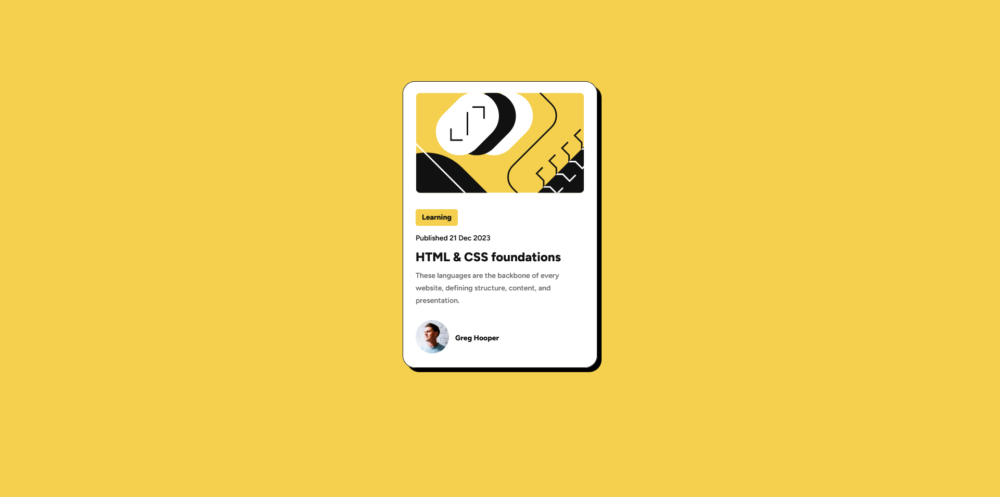
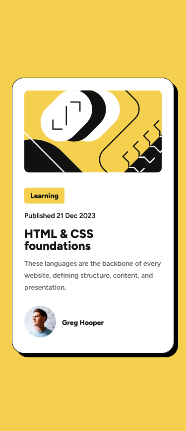

# Frontend Mentor - Blog preview card solution

This is a solution to the [Blog preview card challenge on Frontend Mentor](https://www.frontendmentor.io/challenges/blog-preview-card-ckPaj01IcS). Frontend Mentor challenges help you improve your coding skills by building realistic projects.

## Table of contents

- [Overview](#overview)
  - [Screenshot](#screenshot)
  - [Links](#links)
- [My process](#my-process)
  - [Built with](#built-with)
  - [What I learned](#what-i-learned)
  - [Useful resources](#useful-resources)
- [Author](#author)

## Overview

### Screenshot

Desktop view:



Mobile view:



### Links

- Live Site URL: [https://sunnyegg.github.io/blog-preview](https://sunnyegg.github.io/blog-preview)

## My process

### Built with

- Semantic HTML5 markup
- CSS custom properties
- Flexbox
- Mobile-first workflow

### What I learned

#### Mobile-first workflow

It's easier to build a responsive website using mobile-first workflow. I worked on the mobile version first, and then I worked on larger screens. I struggled a little bit with the responsiveness, such as setting the margin of the card, to make the card centered on the page.

```css
@media screen and (min-width: 376px) {
  main {
    /* divided by 8 because we need to place it on both side of the margin */
    margin: 156px calc(100% / 8);
  }
}
```

To make it centered horizontally, I use `calc()` and `100%` of the screen user currently have divided by `8`.

### Useful resources

- [A Hands-On Guide to Mobile-First Responsive Design](https://www.uxpin.com/studio/blog/a-hands-on-guide-to-mobile-first-design/) - Good article on mobile-first design.

## Author

- Github - [sunnyegg](https://github.com/sunnyegg)
- Personal Website - (still working on it)
