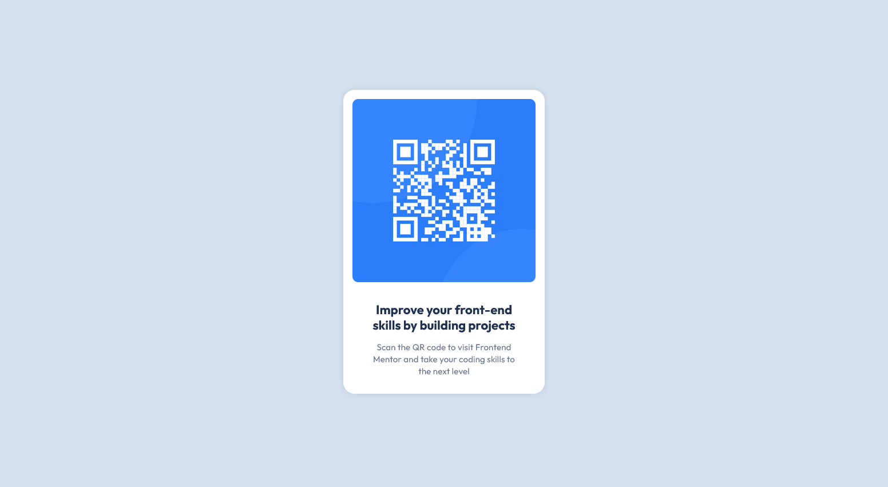

# Frontend Mentor - QR code component solution

This is a solution to the [QR code component challenge on Frontend Mentor](https://www.frontendmentor.io/challenges/qr-code-component-iux_sIO_H). Frontend Mentor challenges help you improve your coding skills by building realistic projects.

## Table of contents

- [Overview](#overview)
  - [Screenshot](#screenshot)
  - [Links](#links)
- [My process](#my-process)
  - [Built with](#built-with)
  - [What I learned](#what-i-learned)
  - [Useful resources](#useful-resources)
- [Author](#author)

## Overview

### Screenshot

Desktop view:



Mobile view:


### Links

- Live Site URL: [https://sunnyegg.github.io/qr-code](https://sunnyegg.github.io/qr-code)

## My process

### Built with

- Semantic HTML5 markup
- CSS custom properties
- Flexbox
- Mobile-first workflow

### What I learned

#### Flexbox

I learned how to layout a page using Flexbox. For me, it's easier to use flexbox than CSS Grid. For example, to create a card, I use the following code:

```html
<section class="card">
  <div class="card-header">...</div>
  <div class="card-body">...</div>
</section>
```

```css
.card {
  display: flex;
  flex-direction: column;
  align-items: center;
}
```

I can just set the container of the card to be `display: flex` and `flex-direction: column`, to layout the content in vertical columns, and then I use `align-items: center` to center the content horizontally.

If I want to add gaps between the content, I can use `gap` property. It's pretty straightforward to use.

#### Set Custom Font

I learned how to set custom font. I used the following code to set the font:

```css
@font-face {
  font-family: "Outfit";
  src: url(/public/font/Outfit-Regular.ttf);
}
```

Usually, I import the font using the embed code on the google fonts website. Using `<link>` tag, or `@import` tag is very easy. But, sometimes not all the fonts are available on the website. So, I need to learn how to set custom font on my own.

### Useful resources

- [CSS Tricks Flexbox Guide](https://css-tricks.com/snippets/css/a-guide-to-flexbox/) - Very useful guide to learn Flexbox.
- [Google Fonts](https://fonts.google.com/) - I used this website to download the font.

## Author

- Github - [sunnyegg](https://github.com/sunnyegg)
- Personal Website - (still working on it)
