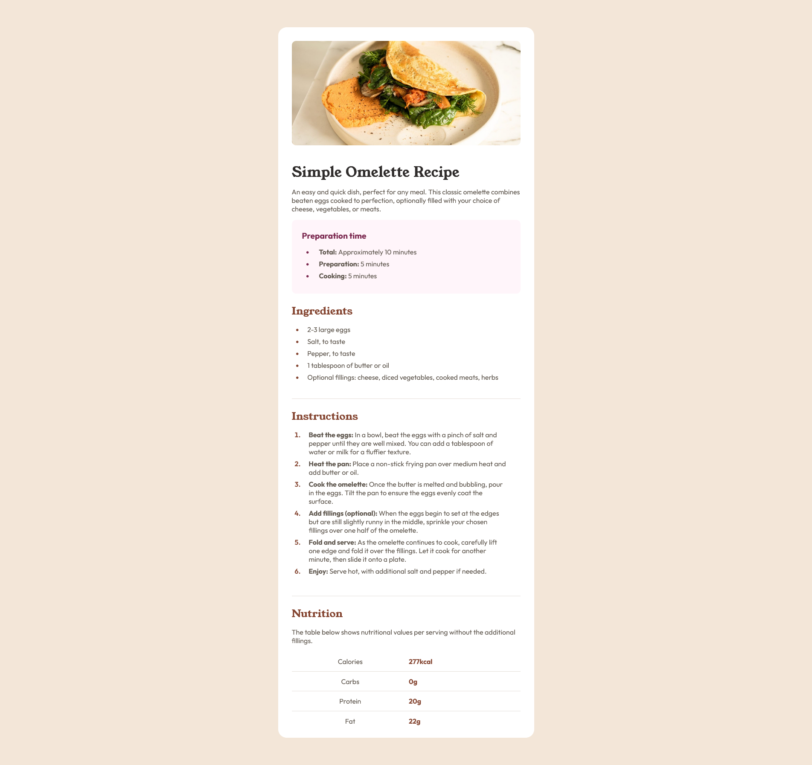
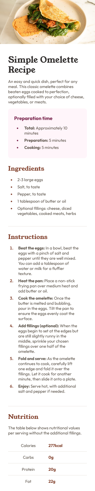

# Frontend Mentor - Recipe page solution

This is a solution to the [Recipe page challenge on Frontend Mentor](https://www.frontendmentor.io/challenges/recipe-page-KiTsR8QQKm). Frontend Mentor challenges help you improve your coding skills by building realistic projects.

## Table of contents

- [Overview](#overview)
  - [Screenshot](#screenshot)
  - [Links](#links)
- [My process](#my-process)
  - [Built with](#built-with)
  - [What I learned](#what-i-learned)
- [Author](#author)

## Overview

### Screenshot

Desktop view:

Mobile view:

### Links

- Live Site URL: [https://sunnyegg.github.io/recipe-page](https://sunnyegg.github.io/recipe-page)

## My process

### Built with

- Semantic HTML5 markup
- CSS custom properties
- Flexbox
- Mobile-first workflow

### What I learned

#### Styling Table

There is a border bottom on each row, at first, my border is not connected on the `<tr>`. Turns out, I need to add `border-collapse: collapse` to the table to make it work.

## Author

- Github - [sunnyegg](https://github.com/sunnyegg)
- Personal Website - (still working on it)
