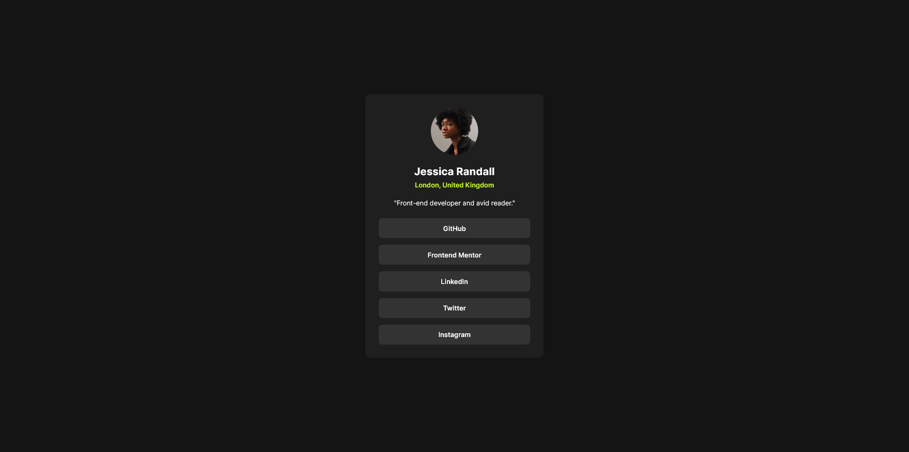
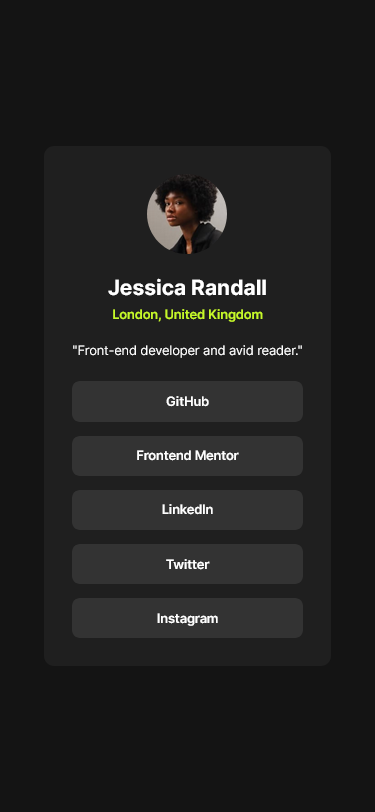

# Frontend Mentor - Social links profile solution

This is a solution to the [Social links profile challenge on Frontend Mentor](https://www.frontendmentor.io/challenges/social-links-profile-UG32l9m6dQ). Frontend Mentor challenges help you improve your coding skills by building realistic projects.

## Table of contents

- [Overview](#overview)
  - [Screenshot](#screenshot)
  - [Links](#links)
- [My process](#my-process)
  - [Built with](#built-with)
  - [What I learned](#what-i-learned)
- [Author](#author)

## Overview

### Screenshot

Desktop view:

Mobile view:

### Links

- Live Site URL: [https://sunnyegg.github.io/social-links-profile](https://sunnyegg.github.io/social-links-profile)

## My process

### Built with

- Semantic HTML5 markup
- CSS custom properties
- Flexbox
- Mobile-first workflow

### What I learned

#### Centering Elements

For the card, I struggled a little bit with the responsiveness, such as setting the margin of the card, to make the card centered on the page. From the previous challenge, I learned that I can use `min-height: 100vh` to make the page full height, and then use `display: flex` and `justify-content: center` to center the content.

## Author

- Github - [sunnyegg](https://github.com/sunnyegg)
- Personal Website - (still working on it)
